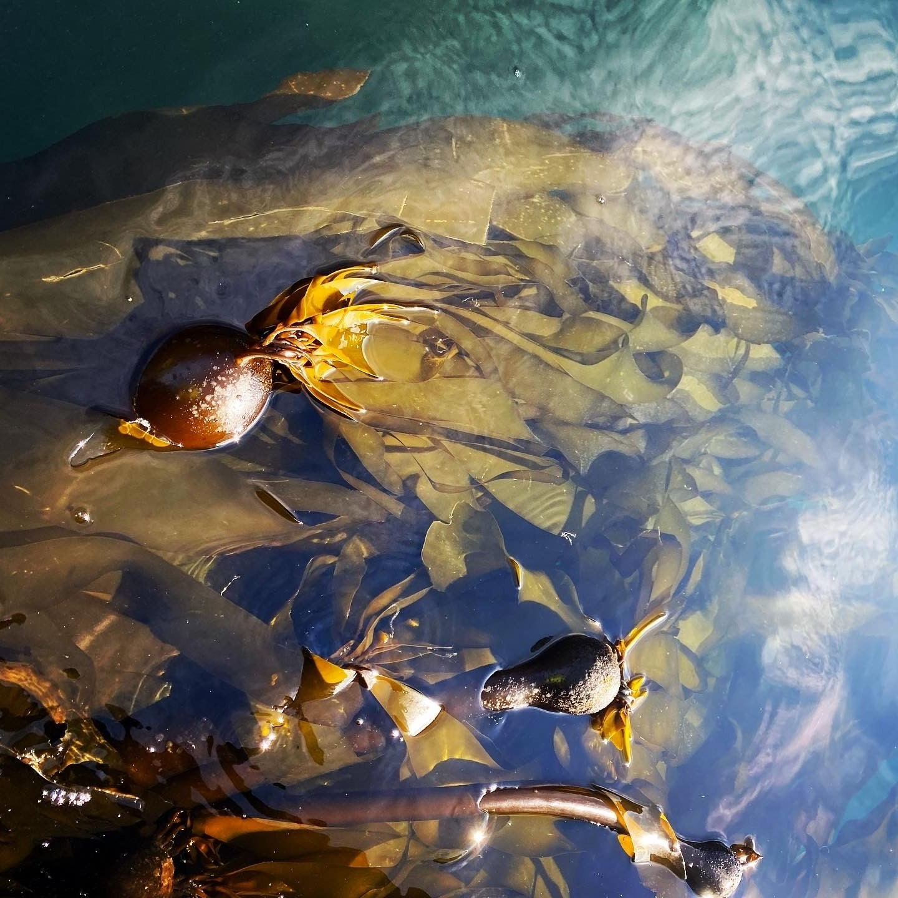

    
Row
-------------------------------------
    
###

```{r,fig.cap="",out.width="100%",fig.align="center",echo=FALSE}

```


###
    

```{r,fig.cap="",out.width="75%",fig.align="center",echo=FALSE}

```


Row
-------------------------------------
    
### 
    

```{r,fig.cap="",out.width="75%",fig.align="center",echo=FALSE}

```


###


```{r,fig.cap="",out.width="75%",fig.align="center",echo=FALSE}

```

