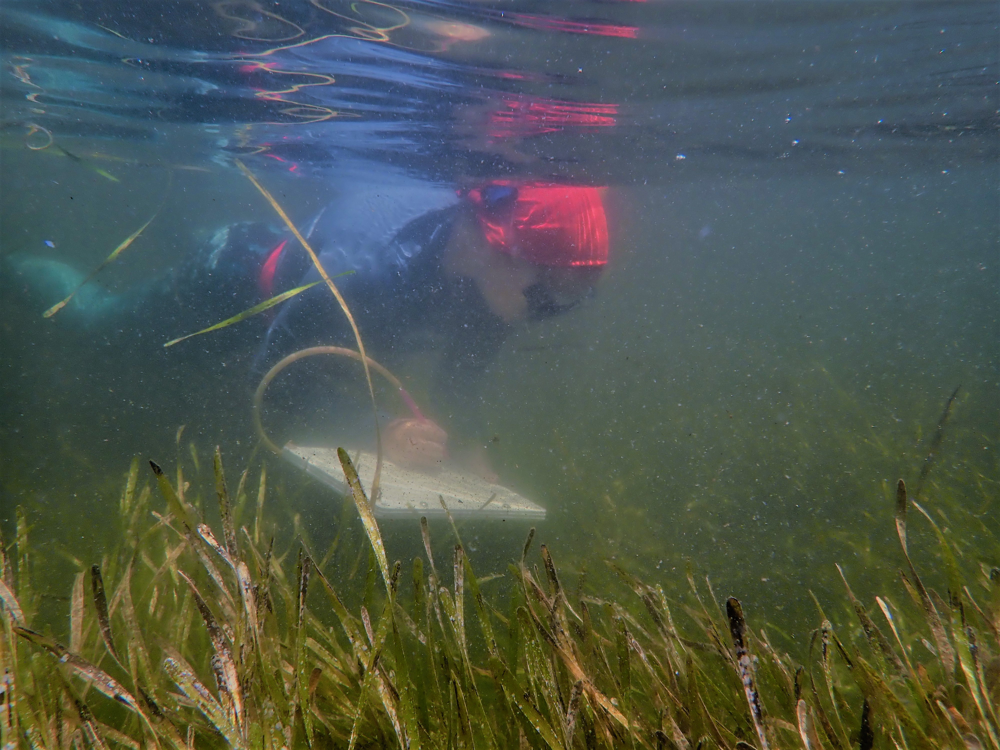
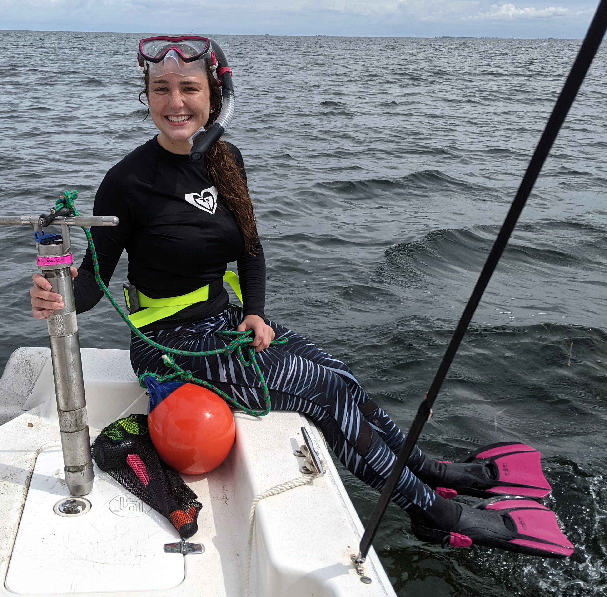
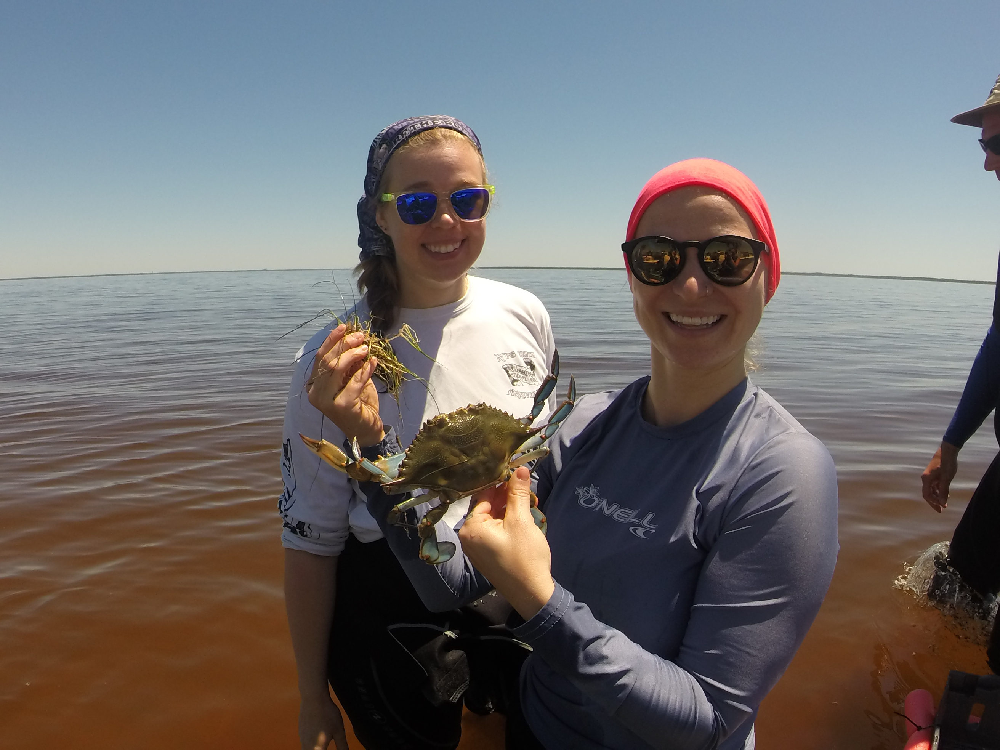
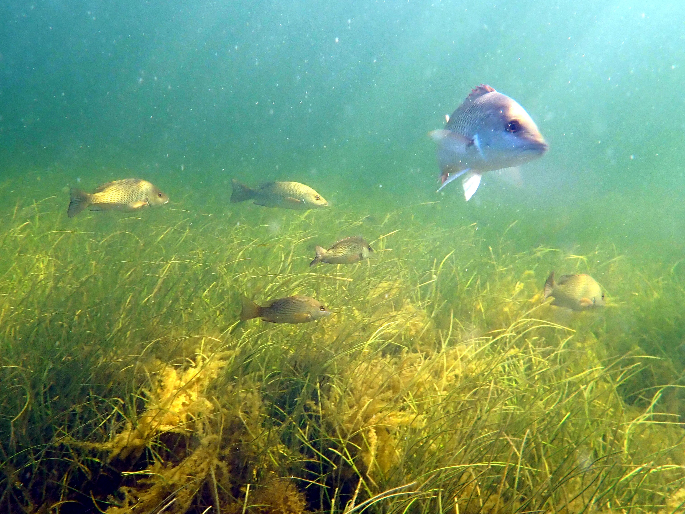
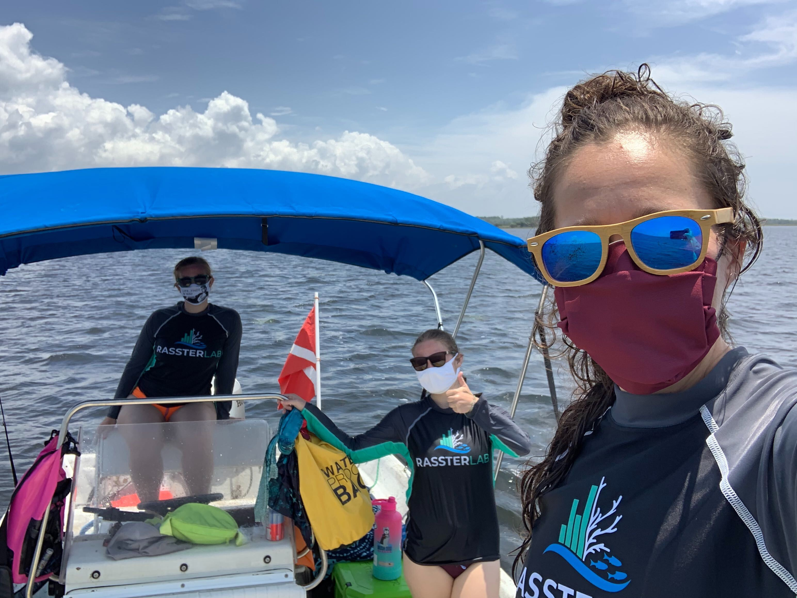
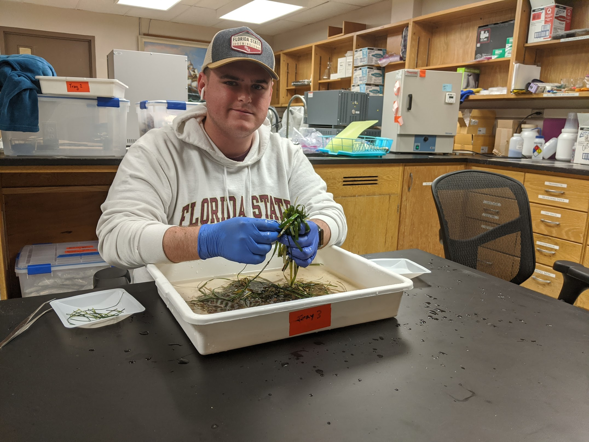
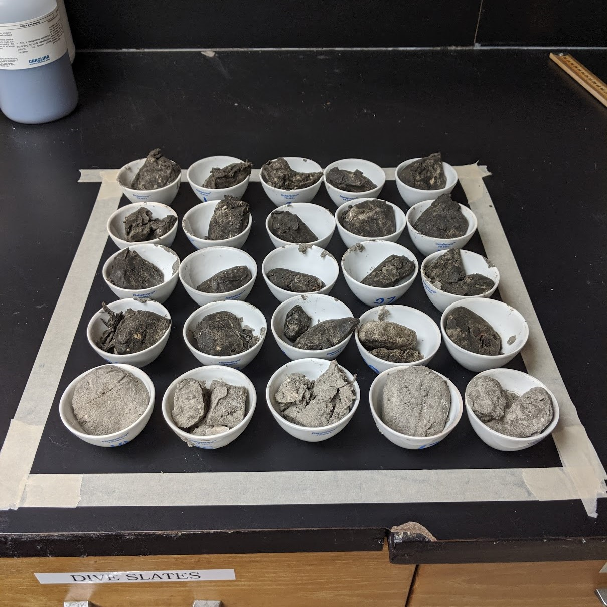
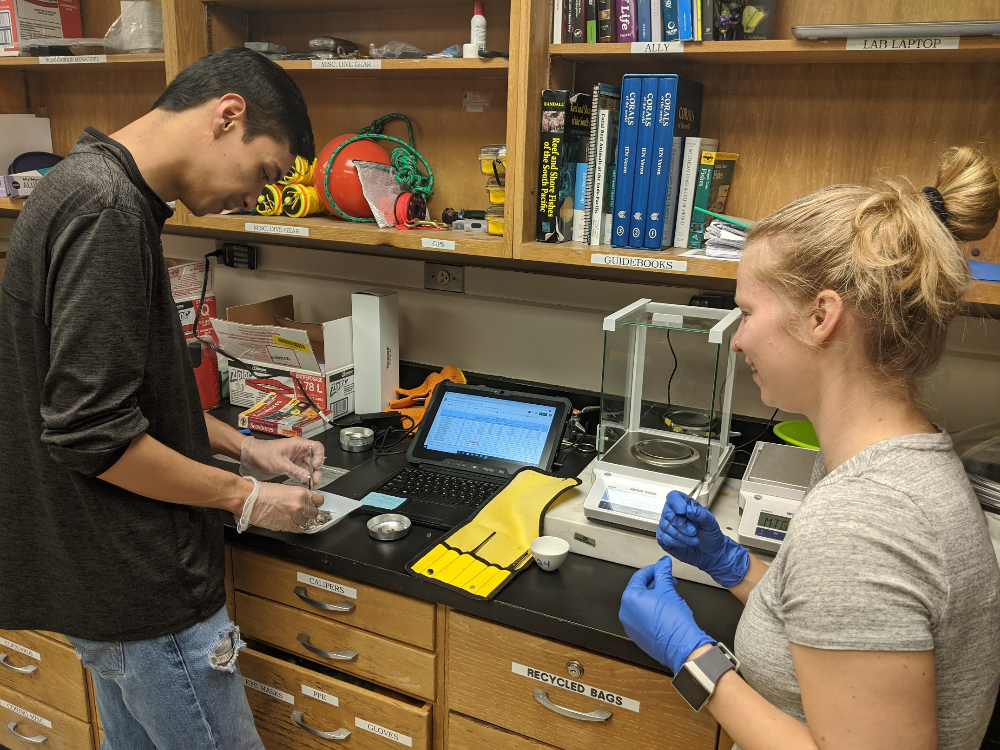
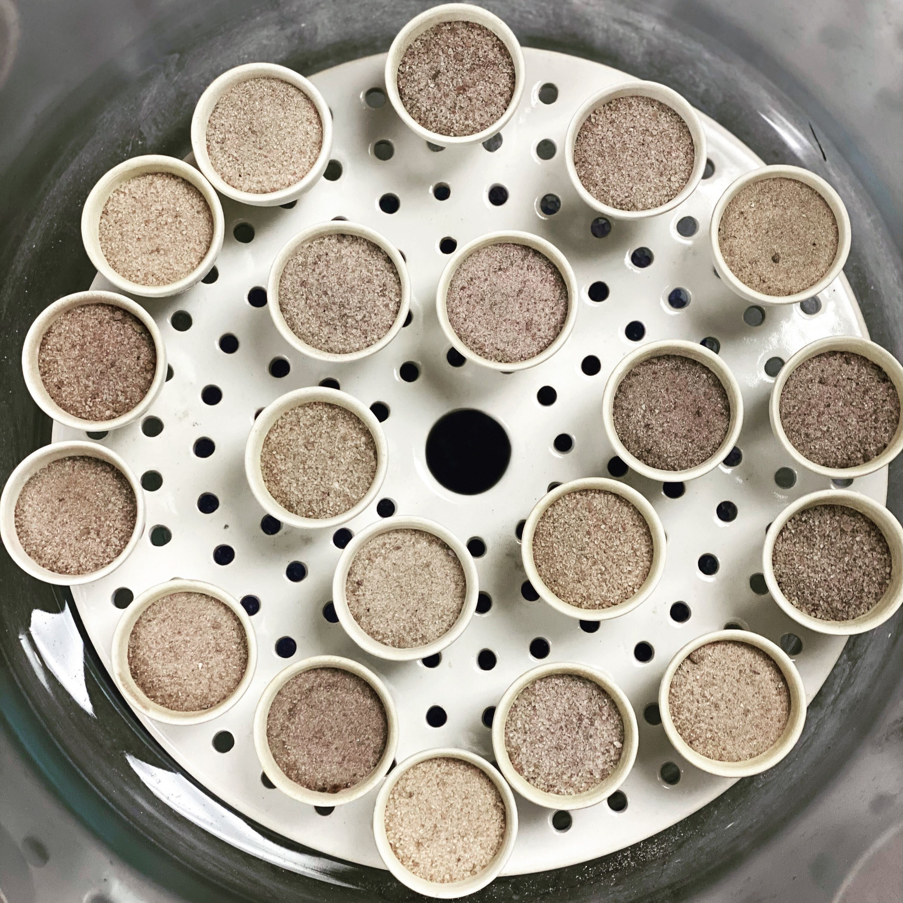

    
### Seagrass Field Research on the Florida Gulf Coast 

```{r,fig.cap="",out.width="100%",fig.align="center",echo=FALSE}

```

```{r,fig.cap="",out.width="100%",fig.align="center",echo=FALSE}

```

```{r,fig.cap="",out.width="100%",fig.align="center",echo=FALSE}
knitr::include_graphics("photos/team_w_core.jpg")
```

```{r,fig.cap="",out.width="100%",fig.align="center",echo=FALSE}
knitr::include_graphics("photos/sarah_and_Caroline.jpg")
```


```{r,fig.cap="",out.width="100%",fig.align="center",echo=FALSE}

```


```{r,fig.cap="",out.width="100%",fig.align="center",echo=FALSE}

```


```{r,fig.cap="",out.width="100%",fig.align="center",echo=FALSE}

```

   
### Blue Carbon Analysis

```{r,fig.cap="",out.width="100%",fig.align="center",echo=FALSE}

```

```{r,fig.cap="",out.width="100%",fig.align="center",echo=FALSE}

```

```{r,fig.cap="",out.width="100%",fig.align="center",echo=FALSE}

```

```{r,fig.cap="",out.width="100%",fig.align="center",echo=FALSE}

```
