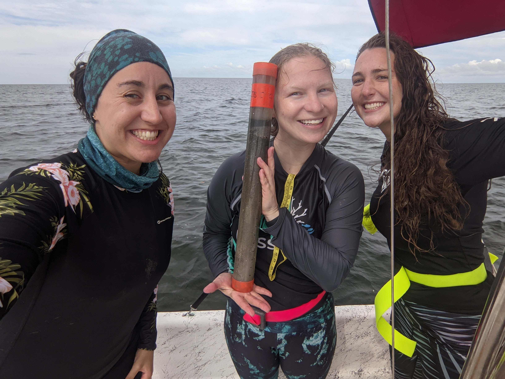

    
### NASEM Florida Gulf Seagrass Field Research

```{r,fig.cap="",out.width="100%",fig.align="center",echo=FALSE}
knitr::include_graphics("photos/Jenn_seagrass_surveys.jpg")
```

```{r,fig.cap="",out.width="100%",fig.align="center",echo=FALSE}
knitr::include_graphics("photos/caroline_core.jpg")
```

```{r,fig.cap="",out.width="100%",fig.align="center",echo=FALSE}

```

```{r,fig.cap="",out.width="100%",fig.align="center",echo=FALSE}
knitr::include_graphics("photos/sarah_and_Caroline.jpg")
```


```{r,fig.cap="",out.width="100%",fig.align="center",echo=FALSE}
knitr::include_graphics("photos/seagrass_restoration.JPG")
```


```{r,fig.cap="",out.width="100%",fig.align="center",echo=FALSE}

```


   
<<<<<<< HEAD
### NASEM Florida Gulf Blue Carbon Analysis
=======
### NASEM Florida Gulf Blue Carbon Sampling
>>>>>>> 9a1a496201f79c4290b7697f4ae6f223ad982897

```{r,fig.cap="",out.width="100%",fig.align="center",echo=FALSE}

```

```{r,fig.cap="",out.width="100%",fig.align="center",echo=FALSE}
knitr::include_graphics("photos/Drying.jpg")
```

```{r,fig.cap="",out.width="100%",fig.align="center",echo=FALSE}
knitr::include_graphics("photos/Nick_and_Jenn.jpg")
```
