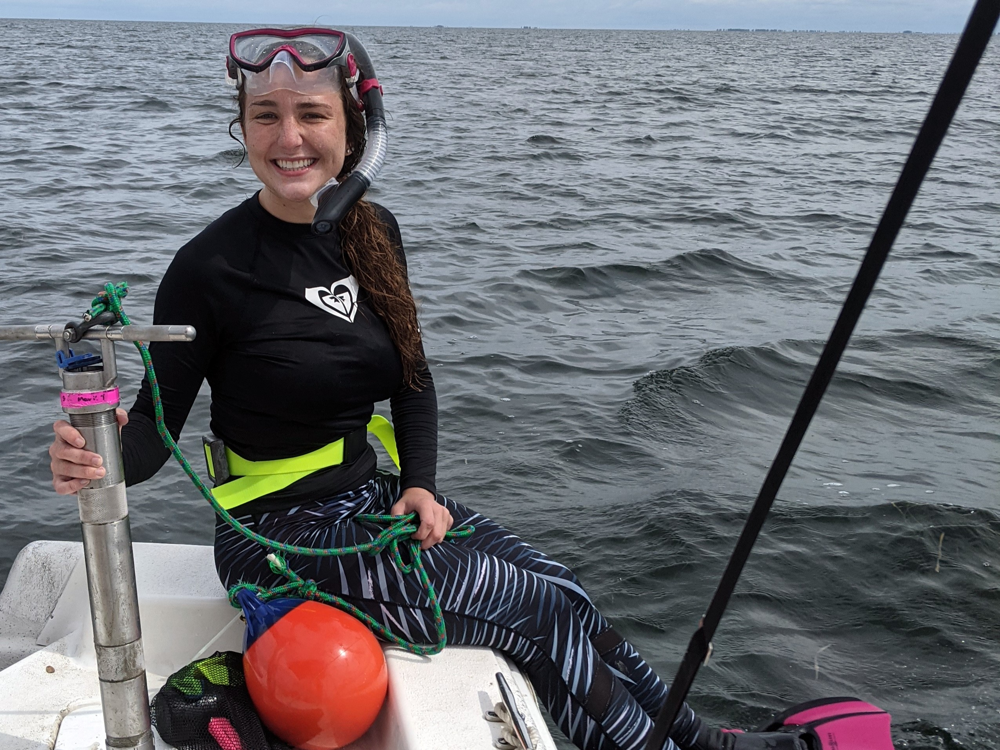

    
## Seagrass Field Research on the Florida Gulf Coast 

```{r,fig.cap="",out.width="50%",fig.ncol=4,echo=FALSE}
knitr::include_graphics("photos/Jenn_seagrass_surveys.jpg")

knitr::include_graphics("photos/team_w_core.jpg")
knitr::include_graphics("photos/sarah_and_Caroline.jpg")
```


```{r,fig.cap="",out.width="50%",echo=FALSE}
knitr::include_graphics("photos/COVID_Boating.jpg")
knitr::include_graphics("photos/Biodiversity.jpg")
knitr::include_graphics("photos/seagrass_restoration.JPG")


```

   
## Blue Carbon Analysis

```{r,fig.cap="",out.width="50%",echo=FALSE}
knitr::include_graphics("photos/Jacob_biomass.jpg")
knitr::include_graphics("photos/Nick_and_Jenn.jpg")


```
