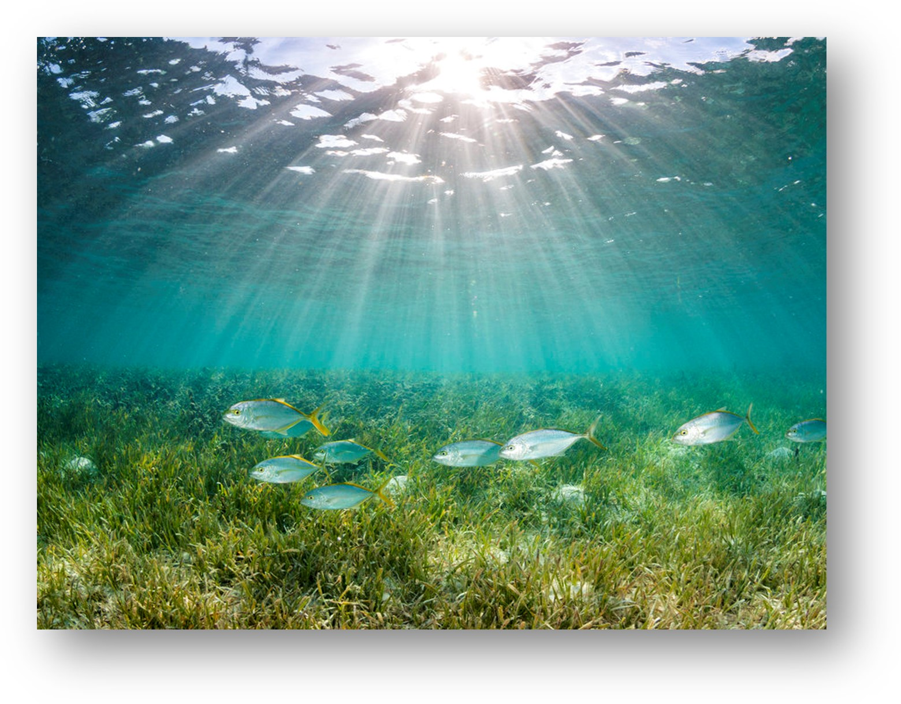
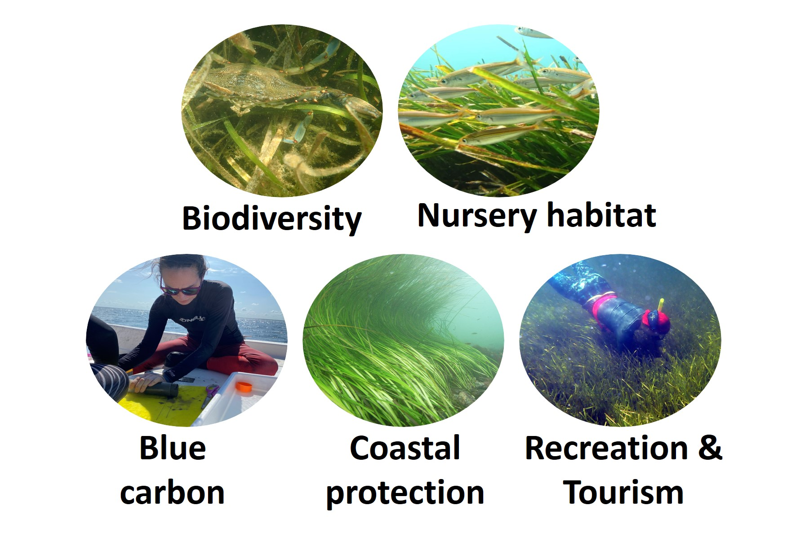
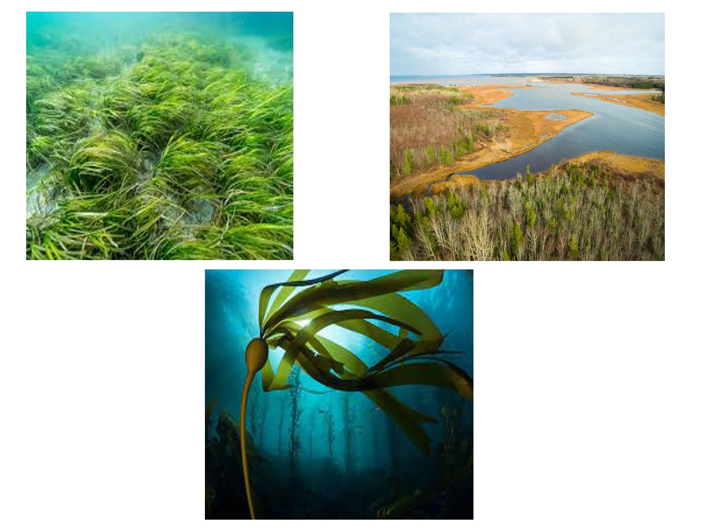
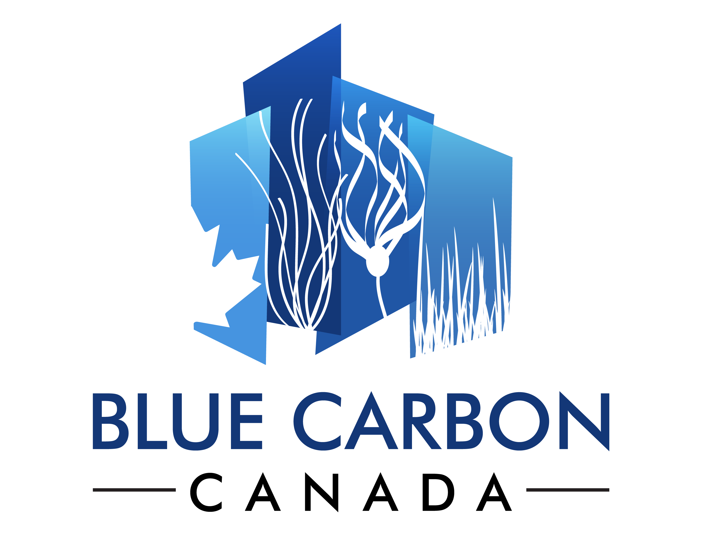

# Research Themes

### Biogeographical & ecological effects of ocean climate change

The first major theme of my research addresses the biogeographical and ecological effects of ocean climate change on coastal and marine ecosystems. My research examines the effects of gradual climate changes (e.g., such as ocean warming and sea-level rise) on the geographic distributions of coastal marine species. Increasingly, I also consider the effects of extreme climatic events (e.g., marine heatwaves) and how climate-driven losses and redistribution of marine foundation species (e.g., seagrass beds and kelp forests)  impacts the ecological structure and functions of coastal ecosystems. For this work, I tend to integrate statistical models, spatial analysis, and data synthesis approaches with observational data, ocean-climate forecasts, and high-performance computing.  

<!--  -->

### Coastal management scenarios to achieve ecological & societal co-benefits

The second major theme of my research examines the dynamic interactions between coastal ecosystems and people, with a particularly focus on the diverse ecological and societal benefits of marine foundation species. My research examines the biophysical drivers and spatial patterns of ecosystem service delivery and uses scenario modeling approaches to quantify the potential co-benefits of habitat conservation and restoration. Increasingly my research also explores how spatial planning and prioritization approaches can be implemented to ensure sustainable and equitable outcomes for nature and people under climate change.


<!--  -->

### Oceans as natural climate solutions

An emerging theme of my research addresses the potential for blue carbon ecosystems (BCEs) to contribute natural climate solutions (NCS). Foundation habitats, such as seagrass beds, tidal marshes, and potentially kelp forests, are thought to play a globally significant role as natural reservoirs for organic and inorganic carbon. However, there is still considerable uncertainty in their estimated extents and relative rates of carbon accumulation. My research seeks to resolve these uncertainties and to critically evaluate whether BCEs could provide viable climate mitigation pathways through their expanded conservation and restoration. 

<!--  -->


# Current & Recently Completed Projects

- [Evaluating the current and future capacity for natural climate solutions in Canada's ocean.](www.BlueCarbonCanada.ca) Research funded by the Natural Science and Engineering Research Council (NSERC) and Fisheries and Oceans Canada (DFO)

- [Developing an integrated monitoring and assessment framework for evaluating ecosystem service outcomes from seagrass restoration in the Gulf of Mexico](https://www.lester-lab.com/seagrass) Research funded by the National Academy of Science, Engineering, and Mathematics (NASEM) Gulf Research Program. 


# Funders

```{r,fig.cap="",out.width="50%",fig.ncol==4,echo=FALSE}
knitr::include_graphics("photos/FisheriesandOceansLogo.png")



```

